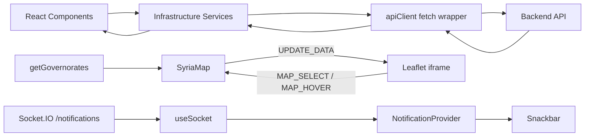
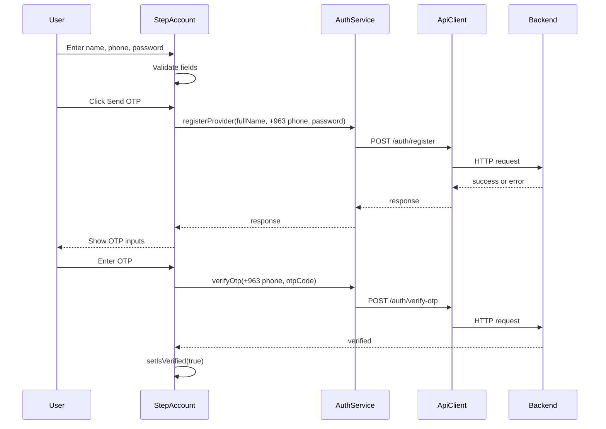
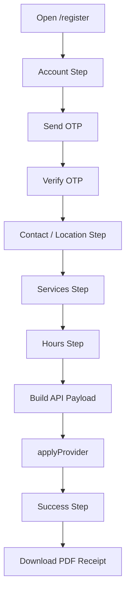

# CAR_HERO_FRONTEND_WEBSITE Technical and Functional Documentation

This document is the single source of truth for the `CAR_HERO_FRONTEND_WEBSITE` project.

It was produced from the actual source code of the website project. It documents implemented behavior, UI-only behavior, mock behavior, API contracts used by the frontend, architecture, business flows, and known limitations. It does not describe features that are not present in the website code.

## Table Of Contents

1. [Project Overview](#1-project-overview)
2. [Technology Stack](#2-technology-stack)
3. [Project Structure](#3-project-structure)
4. [Website Architecture](#4-website-architecture)
5. [Pages Documentation](#5-pages-documentation)
6. [Components Documentation](#6-components-documentation)
7. [Authentication System](#7-authentication-system)
8. [Provider Registration Workflow](#8-provider-registration-workflow)
9. [Service Request Workflow](#9-service-request-workflow)
10. [User Workflows](#10-user-workflows)
11. [API Integration](#11-api-integration)
12. [State Management](#12-state-management)
13. [Forms System](#13-forms-system)
14. [Maps And Geolocation](#14-maps-and-geolocation)
15. [Notifications And Messaging](#15-notifications-and-messaging)
16. [External Services](#16-external-services)
17. [Design System](#17-design-system)
18. [Performance Optimizations](#18-performance-optimizations)
19. [Security Considerations](#19-security-considerations)
20. [Environment Configuration](#20-environment-configuration)
21. [Known Limitations](#21-known-limitations)
22. [Complete Feature Inventory](#22-complete-feature-inventory)
23. [Developer Onboarding Guide](#23-developer-onboarding-guide)
24. [How CAR_HERO_FRONTEND_WEBSITE Works Internally](#24-how-car_hero_frontend_website-works-internally)

---

## 1. Project Overview

### What Is Car Hero

Car Hero is a car-service platform for Syria. The website presents the platform to customers and service providers, explains roadside assistance and automotive services, shows coverage, promotes the mobile app, and provides a provider onboarding flow.

The source code shows two real website responsibilities:

- Public marketing and discovery website for the Car Hero product.
- Provider application/registration flow that collects business, service, location, schedule, and attachment metadata.

The website does not implement the complete customer booking product. Booking, provider selection, payments, subscription management, loyalty point redemption, and customer-service execution are promoted in the landing page content, but they are not implemented as website workflows.

### Purpose Of The Website

The website exists to:

- Explain Car Hero's value proposition.
- Present service categories and platform benefits.
- Show how customers request help through the app.
- Display visual app screenshots.
- Show a Syria governorate coverage map.
- Promote loyalty and subscription plans.
- Collect provider partner applications.
- Send provider application data to the backend through `/providers/apply` when mock mode is disabled.

### Target Users

The code targets these user groups:

- Visitors/customers evaluating the Car Hero mobile service.
- Vehicle owners looking for roadside assistance, towing, fuel delivery, tires, battery, and maintenance support.
- Service providers who want to register as Car Hero partners.
- Business stakeholders reviewing public coverage, statistics, and partner acquisition flow.

### Main Business Goals

The business goals reflected in the source are:

- Convert visitors to mobile app users.
- Convert repair shops and mobile technicians to provider applicants.
- Communicate platform trust signals: certified providers, 24/7 support, transparent pricing, coverage, loyalty, and subscriptions.
- Collect enough provider data for review and activation by the backend/admin side.
- Present Syria-specific location coverage.

### Relationship To The Complete Car Hero Ecosystem

The website is one frontend inside a larger Car Hero ecosystem.

| System | Role In Ecosystem | Website Relationship |
| --- | --- | --- |
| Website | Public marketing, provider registration, coverage map, app promotion | This project. It consumes public and provider-registration backend APIs. |
| Backend | API, OTP, provider application, public statistics, governorates, notifications | The website uses `/auth/*`, `/providers/apply`, `/providers/public/*`, and Socket.IO notifications. Current service files run in mock mode by default. |
| Mobile App | Main customer experience for requesting service, subscriptions, loyalty, payments, and provider/customer communication | The website promotes this app through screenshots, download CTAs, pricing, loyalty, and "how it works" content. It does not implement the mobile app flows. |
| Admin Dashboard | Operational control plane for reviewing providers, managing data, and platform administration | The registration success text implies submitted providers are reviewed before activation. Admin implementation is outside this project. |
| Provider Dashboard | Provider operational dashboard after approval | The website collects provider application data. It does not contain provider dashboard pages. |

---

## 2. Technology Stack

### Core Frameworks And Languages

| Technology | Where Used | Responsibility |
| --- | --- | --- |
| React `19.1.1` | Entire `src` application | Component model, state, effects, lazy page loading. |
| React DOM `19.1.1` | `src/main.jsx` | Mounts React into `#root`. |
| JavaScript / JSX | All source files | Application implementation language. |
| Vite via `rolldown-vite@7.1.14` | `package.json`, `vite.config.js` | Development server, build, asset processing, module bundling. |
| React Router DOM `7.9.5` | `src/main.jsx`, `src/App.jsx`, `Navbar`, `ContactSection` | Browser routing for `/` and `/register`, navigation to registration. |

### UI And Styling

| Technology | Where Used | Responsibility |
| --- | --- | --- |
| MUI `@mui/material` v7 | Layout, navbar, footer, sections, form controls, snackbar, cards | Primary component library for polished UI primitives. |
| MUI Icons | Landing sections, navbar, statistics, footer | Iconography for feature/service/CTA visuals. |
| Emotion | `RootProvider`, theme system | MUI styling engine and RTL cache handling. |
| `stylis` and `stylis-plugin-rtl` | `RootProvider` | Mirrors styles for Arabic RTL mode. |
| Tailwind CSS v4 | `index.css`, registration components | Utility-first styling and global CSS import. |
| CSS variables | `src/index.css` | Light/dark theme tokens and landing/register styles. |
| Framer Motion | Landing sections and animations | Scroll reveal, animated cards, transitions, carousel effects. |
| Lucide React | Registration, loader, provider form controls | Icons for provider registration and utility UI. |

### Internationalization

| Technology | Where Used | Responsibility |
| --- | --- | --- |
| i18next | `src/infrastructure/i18n.js` | Translation runtime. |
| react-i18next | Components and pages | `useTranslation()` hooks and translated UI copy. |
| JSON locale files | `src/infrastructure/locales/ar`, `src/infrastructure/locales/en` | Landing, footer, pricing, FAQ, stats, and website copy. |
| Internal registration translations | `src/presentation/components/register/translations.js` | Registration wizard field labels, locations, services, errors, success text. |

Note: `i18next-browser-languagedetector` is installed but not used in `i18n.js`. The default language is hard-coded to Arabic.

### API, Realtime, And Data

| Technology | Where Used | Responsibility |
| --- | --- | --- |
| Fetch API | `src/infrastructure/api/client.js` | HTTP GET/POST wrapper. |
| Socket.IO Client | `src/application/hooks/useSocket.js` | Realtime notification connection to `/notifications`. |
| Browser localStorage | theme, auth token lookup | Stores theme mode and reads possible auth tokens. |
| Browser Geolocation API | `StepContact.jsx` | Captures provider coordinates during registration. |

### Forms And Validation

No form library is used. There is no Formik, React Hook Form, Zod, or Yup in this project.

Forms are built from:

- Local React state.
- Custom input/select components.
- Manual validation functions inside step components.
- Button disabled states and error messages.

### Charts And Maps

| Technology | Where Used | Responsibility |
| --- | --- | --- |
| Leaflet CDN | `public/maps/syria_choropleth.html` | Embedded Syria choropleth map rendering. |
| Embedded GeoJSON | `public/maps/syria_choropleth.html` | Governorate polygon boundaries and initial values. |
| iframe and `postMessage` | `SyriaMap.jsx` and `syria_choropleth.html` | Communication between React and the Leaflet map document. |
| react-countup | `StatisticsSection.jsx` | Animated public statistics counters. |

There is no charting library such as Recharts, Chart.js, or ApexCharts.

### PDF And Asset Generation

| Technology | Where Used | Responsibility |
| --- | --- | --- |
| html2canvas | `StepSuccess.jsx` | Captures hidden registration receipt pages. |
| jsPDF | `StepSuccess.jsx` | Generates downloadable provider registration PDF. |
| URL object APIs | `StepServices.jsx`, `StepSuccess.jsx` | Creates file preview URLs and temporary download URLs. |

### Build, Lint, And Deployment

| Tool | Where Used | Responsibility |
| --- | --- | --- |
| ESLint 9 | `eslint.config.js`, `npm run lint` | JS/JSX linting with React Hooks and React Refresh rules. |
| Vercel config | `vercel.json` | Build command, output directory, SPA rewrites to `index.html`. |
| jsconfig paths | `jsconfig.json`, `vite.config.js` | `@/*` alias to `src/*`. |

---

## 3. Project Structure

### Architecture Tree

```text
CAR_HERO_FRONTEND_WEBSITE/
  index.html
  package.json
  package-lock.json
  vite.config.js
  eslint.config.js
  jsconfig.json
  vercel.json
  README.md
  public/
    logo_carHero.png
    photo_car_hero/
      photo_1.jpg ... photo_12.jpg
    maps/
      syria_choropleth.html
  src/
    main.jsx
    App.jsx
    index.css
    App.css
    contacts.js
    assets/
      logo_carHero.png
      hero-pg.png
      hero-pg2.png
      header-bg.jpg
    application/
      contexts/
        color-mode.context.js
      hooks/
        useSocket.js
      providers/
        RootProvider.jsx
        NotificationProvider.jsx
    infrastructure/
      api/
        client.js
      services/
        auth.service.js
        providers.service.js
      locales/
        ar/translation.json
        en/translation.json
      i18n.js
    presentation/
      pages/
        Home.jsx
        RegisterPage.jsx
        RegisterPage.css
      theme/
        index.js
      components/
        layout/
          Navbar.jsx
          Footer.jsx
          ErrorBoundary.jsx
          PageLoader.jsx
        landing/
          HeroSection.jsx
          ServiceSection.jsx
          HowItWorks.jsx
          WhyChooseUs.jsx
          CoverageSection.jsx
          LoyaltyRewards.jsx
          PricingPlans.jsx
          AppScreenshots.jsx
          SalientFeatures.jsx
          StatisticsSection.jsx
          ContactSection.jsx
          TestimonialsSection.jsx
          TeamSection.jsx
          DownloadSection.jsx
        map/
          SyriaMap.jsx
        register/
          RegisterFlow.jsx
          StepAccount.jsx
          StepContact.jsx
          StepServices.jsx
          StepHours.jsx
          StepSuccess.jsx
          RegistrationReceipt.jsx
          Input.jsx
          CustomSelect.jsx
          FileUpload.jsx
          Stepper.jsx
          translations.js
          types.js
        ui/
          icons.jsx
```

### Root Files

| File | Responsibility |
| --- | --- |
| `package.json` | Defines scripts and dependencies. Scripts: `dev`, `build`, `lint`, `preview`. |
| `vite.config.js` | Configures React plugin, Tailwind plugin, and `@` alias to `src`. |
| `eslint.config.js` | ESLint flat config for JS/JSX, React Hooks, React Refresh, ignores `dist`. |
| `jsconfig.json` | Editor/JS path alias config for `@/*`. |
| `vercel.json` | Vercel build and SPA rewrite configuration. |
| `index.html` | Vite HTML shell, root mount node, fonts, favicon, app title. |
| `README.md` | Short existing project README. |

Important note: `index.html` contains an import map pointing React packages to CDN versions. In a normal Vite build, local bundled dependencies are used. This import map is legacy/confusing and should be reviewed.

### `public`

| Path | Responsibility |
| --- | --- |
| `public/logo_carHero.png` | Public favicon/logo asset referenced by `index.html`. |
| `public/photo_car_hero/` | 12 app screenshot images used by `AppScreenshots.jsx`. |
| `public/maps/syria_choropleth.html` | Standalone Leaflet map document embedded by `SyriaMap.jsx`. |

### `src/assets`

Contains bundled image assets:

- `logo_carHero.png`: logo used in React components and PDF receipt.
- `hero-pg.png`: phone/app visual used by landing and feature sections.
- `hero-pg2.png`: secondary visual used by the hero section.
- `header-bg.jpg`: background image for hero/download sections.

### `src/application`

Application-level cross-cutting code:

- `RootProvider.jsx`: theme, language direction, Emotion RTL cache, MUI provider, and app bootstrap.
- `NotificationProvider.jsx`: realtime notification UI, snackbar, severity mapping, chime sound.
- `useSocket.js`: Socket.IO client setup.
- `color-mode.context.js`: theme toggle context.

### `src/infrastructure`

Infrastructure and integration layer:

- `api/client.js`: fetch wrapper with base URL and bearer token header.
- `services/auth.service.js`: provider registration OTP endpoints, currently mock by default.
- `services/providers.service.js`: provider application/public statistics/governorates endpoints, currently mock by default.
- `i18n.js`: i18next initialization.
- `locales/`: global translation files.

### `src/presentation`

UI, pages, visual components, registration wizard, and theme.

This layer owns:

- Routes/pages.
- Landing page sections.
- Layout components.
- Provider registration wizard.
- Syria map React wrapper.
- MUI theme factory.

---

## 4. Website Architecture

### Application Architecture

The app is a client-side React SPA.

Entry sequence:

1. `src/main.jsx` imports i18n and global CSS.
2. React renders inside `#root`.
3. `BrowserRouter` wraps `RootProvider`.
4. `RootProvider` configures theme, RTL/LTR, Emotion cache, MUI theme, and renders `App`.
5. `App` wraps routes with `ErrorBoundary`, `NotificationProvider`, and `Suspense`.
6. `Home` and `RegisterPage` are loaded lazily.

```mermaid
flowchart TD
  main[src/main.jsx] --> router[BrowserRouter]
  router --> root[RootProvider]
  root --> cache[Emotion CacheProvider]
  root --> mui[MUI ThemeProvider]
  mui --> app[App]
  app --> boundary[ErrorBoundary]
  boundary --> notify[NotificationProvider]
  notify --> suspense[Suspense PageLoader]
  suspense --> routes[Routes]
  routes --> home[/ -> Home]
  routes --> register[/register -> RegisterPage]
```

### Routing Architecture

Routes are defined in `src/App.jsx`:

| Route | Page | Lazy Loaded | Purpose |
| --- | --- | --- | --- |
| `/` | `Home` | Yes | Public landing page. |
| `/register` | `RegisterPage` | Yes | Provider registration wizard. |

There are no nested routes, protected routes, login routes, dashboard routes, or 404 route in this website project.

### Component Architecture

The component architecture is section-oriented:

- `Home` composes large landing sections.
- Each landing section manages its own local UI state, animations, and content.
- `RegisterPage` delegates all wizard behavior to `RegisterFlow`.
- `RegisterFlow` owns shared registration state and passes it down to individual step components.
- API access is not called directly from most UI components; it goes through service files.

### Layout Architecture

The main layout is:

- Fixed top `Navbar`.
- One route page body.
- Landing sections as full-width blocks.
- `Footer` at the bottom of the landing page.
- Register page uses `Navbar` in `minimal` mode and a centered wizard layout.

### Data Flow Architecture

Data flow is simple and mostly unidirectional:

- Translation data comes from i18next and local registration translations.
- Theme mode is held in `RootProvider`, persisted to `localStorage`, and exposed through context.
- Registration data is held in `RegisterFlow` and passed to steps through props.
- API calls are made through infrastructure services.
- Realtime notifications enter through `useSocket`, are displayed by `NotificationProvider`, and do not currently update page state.
- Map data flows from backend/mock service to `SyriaMap`, then into iframe through `postMessage`.



---

## 5. Pages Documentation

### Page: Home

| Item | Details |
| --- | --- |
| File | `src/presentation/pages/Home.jsx` |
| Route | `/` |
| Purpose | Public landing page for Car Hero. |
| APIs Used | Indirectly through child components: `getGovernorates`, `getPublicStatistics`. |
| Layout | `Navbar`, landing sections, `Footer`. |

Components used in order:

1. `Navbar`
2. `HeroSection`
3. `ServiceSection`
4. `HowItWorks`
5. `WhyChooseUs`
6. `CoverageSection`
7. `LoyaltyRewards`
8. `PricingPlans`
9. `AppScreenshots`
10. `SalientFeatures`
11. `StatisticsSection`
12. `ContactSection`
13. `TestimonialsSection`
14. `DownloadSection`
15. `Footer`

Business logic:

- Presents Car Hero as a car service and roadside assistance platform.
- Promotes mobile app download.
- Explains service categories and workflow.
- Promotes provider partnership through CTAs to `/register`.
- Shows public statistics if backend response matches expected shape.
- Shows coverage map using provider/governorate counts.

User interactions:

- Scroll navigation through navbar links.
- Language toggle.
- Light/dark theme toggle.
- Mobile drawer menu.
- App screenshot carousel next/previous/dots.
- Pricing monthly/yearly toggle.
- Contact FAQ accordion.
- Contact form fake submission.
- Download update email fake submission.
- Map hover/select and notify-me form simulation.
- CTA navigation to registration.

### Page: RegisterPage

| Item | Details |
| --- | --- |
| File | `src/presentation/pages/RegisterPage.jsx` |
| Route | `/register` |
| Purpose | Provider application wizard. |
| APIs Used | `registerProvider`, `resendOtp`, `verifyOtp`, `applyProvider`. |
| Main Component | `RegisterFlow` |

Business logic:

- Collects provider account, OTP verification, business location, services, pricing, facilities, files, working hours, and submission data.
- Converts the wizard state into backend provider application payload.
- Shows success page and generates a PDF registration receipt.

User interactions:

- Fill text fields.
- Send/resend OTP.
- Enter 6-digit OTP.
- Select provider type, governorate, district.
- Capture geolocation or open Google Maps.
- Add/remove coverage areas.
- Select services and enter prices.
- Toggle emergency availability and facilities.
- Increment/decrement years of experience and technician count.
- Upload image files.
- Configure working hours per day.
- Submit application.
- Download PDF receipt.
- Return to home.

---

## 6. Components Documentation

### Layout Components

#### `Navbar`

| Item | Details |
| --- | --- |
| File | `src/presentation/components/layout/Navbar.jsx` |
| Props | `minimal?: boolean` |
| Dependencies | MUI, React Router, i18next, `ColorModeContext`, logo asset. |
| Used By | `Home`, `RegisterFlow` |

Purpose:

- Fixed top navigation for the landing page.
- Minimal back/home navigation on registration pages.
- Provides language and theme controls.

Internal logic:

- Maintains `open` for mobile drawer.
- Maintains `activeSection` using scroll spy.
- Maintains `scrolled` for visual style.
- `NAV_SECTION_IDS` are `home`, `services`, `how-it-works`, `coverage-map-section`, `contact`.
- `scrollToSection` applies a header offset: `66px` for mobile and `80px` for desktop.
- Language toggle switches between Arabic and English using `i18n.changeLanguage`.
- Theme toggle calls `ColorModeContext.toggleColorMode`.
- Register CTA navigates to `/register`.

#### `Footer`

| Item | Details |
| --- | --- |
| File | `src/presentation/components/layout/Footer.jsx` |
| Props | None |
| Dependencies | MUI, i18next, MUI icons, logo asset. |
| Used By | `Home` |

Purpose:

- Displays brand summary, service links, quick links, contact information, and visual social icons.

Internal logic:

- Reads footer translations.
- Applies RTL/LTR direction based on current language.
- Quick links include anchors and `/register`.
- Social icon buttons are visual only; no real social URLs are configured.

#### `ErrorBoundary`

| Item | Details |
| --- | --- |
| File | `src/presentation/components/layout/ErrorBoundary.jsx` |
| Props | `children` |
| Dependencies | React class component. |
| Used By | `App` |

Purpose:

- Catches render errors and displays a fallback UI.

Internal logic:

- Uses `getDerivedStateFromError` and `componentDidCatch`.
- Shows a refresh page button.
- Shows error details and component stack in development mode.

#### `PageLoader`

| Item | Details |
| --- | --- |
| File | `src/presentation/components/layout/PageLoader.jsx` |
| Props | None |
| Dependencies | `Loader2` from lucide-react. |
| Used By | `App` Suspense fallback |

Purpose:

- Full-screen loading indicator for lazy routes.

### Landing Components

#### `HeroSection`

| Item | Details |
| --- | --- |
| File | `src/presentation/components/landing/HeroSection.jsx` |
| Section ID | `home` |
| APIs Used | None |
| Dependencies | MUI, Framer Motion, translations, `header-bg.jpg`, `hero-pg.png`, `hero-pg2.png`. |

Purpose:

- First visual landing section.
- Introduces the platform and displays mobile app visuals.
- Includes app download visual CTA.

Business behavior:

- Marketing-only. No backend call.

#### `ServiceSection`

| Item | Details |
| --- | --- |
| File | `src/presentation/components/landing/ServiceSection.jsx` |
| Section ID | `services` |
| APIs Used | None |
| Dependencies | MUI, Framer Motion, MUI icons, translations. |

Purpose:

- Displays five service/value cards from translations.

Business behavior:

- Marketing-only.

#### `HowItWorks`

| Item | Details |
| --- | --- |
| File | `src/presentation/components/landing/HowItWorks.jsx` |
| Section ID | `how-it-works` |
| APIs Used | None |
| Dependencies | MUI, Framer Motion, translations. |

Purpose:

- Shows the customer service-request journey as translated steps.

Business behavior:

- Informational only. It does not create requests or book providers.

#### `WhyChooseUs`

| Item | Details |
| --- | --- |
| File | `src/presentation/components/landing/WhyChooseUs.jsx` |
| Section ID | `features` |
| APIs Used | None |
| Dependencies | MUI, Framer Motion, translations. |

Purpose:

- Displays reasons to trust/use Car Hero.

#### `CoverageSection`

| Item | Details |
| --- | --- |
| File | `src/presentation/components/landing/CoverageSection.jsx` |
| Section ID | `coverage-map-section` |
| APIs Used | Indirectly through `SyriaMap`: `getGovernorates`. |
| Dependencies | MUI, Framer Motion, translations, `SyriaMap`. |

Purpose:

- Wraps the interactive Syria coverage map with translated title/subtitle.

#### `SyriaMap`

| Item | Details |
| --- | --- |
| File | `src/presentation/components/map/SyriaMap.jsx` |
| Embedded File | `public/maps/syria_choropleth.html` |
| APIs Used | `getGovernorates()` |
| Dependencies | React, i18next, provider service, iframe `postMessage`. |

Purpose:

- Displays a Syria coverage map.
- Shows active/coming-soon governorate details.
- Sends provider counts to the Leaflet iframe.

Internal logic:

- Fetches governorates on mount.
- Accepts response shapes: `json.data.data`, `json.data`, or direct array.
- Normalizes governorate objects using `governorate`, `name`, or `_id`.
- Aggregates `count` or `value`.
- Collapses Damascus aliases into `Damascus`.
- Sends data to iframe with:

```js
{ type: "UPDATE_DATA", data: govData }
```

- Receives iframe messages:

```js
{ type: "MAP_SELECT", data: { governorate, status, value } }
{ type: "MAP_HOVER", data: { governorate, status, value } }
```

- Shows:
  - Default panel before selection.
  - Active panel when `status === "active"`.
  - Coming-soon panel otherwise.

Important interaction note:

- The active panel contains a "Request Service" button, but it has no click handler.
- The coming-soon email notification is simulated with `setTimeout`; it does not call an API.

#### `LoyaltyRewards`

| Item | Details |
| --- | --- |
| File | `src/presentation/components/landing/LoyaltyRewards.jsx` |
| Section ID | `loyalty-rewards` |
| APIs Used | None |
| Dependencies | MUI, Framer Motion, translations. |

Purpose:

- Explains loyalty reward mechanics and compares free/premium reward benefits.

Business behavior:

- Marketing-only; no point balance or subscription API is used.

#### `PricingPlans`

| Item | Details |
| --- | --- |
| File | `src/presentation/components/landing/PricingPlans.jsx` |
| Section ID | `pricing` |
| APIs Used | None |
| Dependencies | MUI, Framer Motion, translations. |

Purpose:

- Shows free and premium subscription plans.
- Supports monthly/yearly toggle.
- Includes comparison rows.

Internal state:

- `isYearly` toggles displayed premium price.

Business behavior:

- App-only subscription messaging is displayed.
- No checkout, payment, or subscription API exists in the website.

#### `AppScreenshots`

| Item | Details |
| --- | --- |
| File | `src/presentation/components/landing/AppScreenshots.jsx` |
| Section ID | `app-screenshots` |
| APIs Used | None |
| Assets | `/photo_car_hero/photo_1.jpg` through `/photo_car_hero/photo_12.jpg` |

Purpose:

- Shows a carousel of mobile app screenshots.

Internal logic:

- Maintains `currentIndex`, `direction`, and `isAutoPlaying`.
- Auto-advances every 4000 ms while auto-play is enabled.
- User prev/next/dot interaction disables auto-play.

#### `SalientFeatures`

| Item | Details |
| --- | --- |
| File | `src/presentation/components/landing/SalientFeatures.jsx` |
| Section ID | `screenshot` |
| APIs Used | None |
| Dependencies | MUI, Framer Motion, translations, `hero-pg.png`. |

Purpose:

- Shows feature cards around a central app visual.

Internal logic:

- Uses `useInView` for one-time animation.
- Reads `left_features` and `right_features` arrays from translations.

#### `StatisticsSection`

| Item | Details |
| --- | --- |
| File | `src/presentation/components/landing/StatisticsSection.jsx` |
| APIs Used | `getPublicStatistics()` |
| Dependencies | MUI, Framer Motion, CountUp, translations. |

Purpose:

- Displays animated public platform statistics.

Internal logic:

- Fetches stats on mount.
- Refreshes every 60 seconds.
- Expects backend response shape:

```js
{
  success: true,
  data: {
    customers,
    approvedProviders,
    coveredAreas,
    averageResponseMinutes
  }
}
```

Known implementation issue:

- `providers.service.js` mock returns `{ providers, users, requests }` without `success` and `data`. With `MOCK_API = true`, this section renders no statistic cards.

#### `ContactSection`

| Item | Details |
| --- | --- |
| File | `src/presentation/components/landing/ContactSection.jsx` |
| Section ID | `contact` |
| APIs Used | None |
| Dependencies | React Router, translations, custom UI icons, Framer Motion. |

Purpose:

- Displays FAQ.
- Displays contact form.
- Displays partner cards.
- Provides CTA to `/register`.

Internal logic:

- `activeQuestion` controls FAQ expansion.
- `formData` contains `name`, `email`, `message`.
- Submission is simulated with a 1500 ms timeout.
- Success state resets after 3000 ms.

Business behavior:

- Contact form does not send data to the backend.

#### `TestimonialsSection`

| Item | Details |
| --- | --- |
| File | `src/presentation/components/landing/TestimonialsSection.jsx` |
| APIs Used | None |
| Dependencies | MUI, Framer Motion, translations, remote avatar URLs. |

Purpose:

- Displays testimonial cards.

Internal logic:

- Reads `testimonials.items` from translations.
- Uses fallback testimonial data if translations are missing.

#### `DownloadSection`

| Item | Details |
| --- | --- |
| File | `src/presentation/components/landing/DownloadSection.jsx` |
| Section ID | `download` |
| APIs Used | None |
| Dependencies | MUI, translations, `header-bg.jpg`, external Google Play badge image. |

Purpose:

- Promotes app download.
- Allows visitors to enter an email for updates.

Internal logic:

- Maintains `email`, `isSubmitting`, `isSuccess`.
- Submit is simulated with a 1500 ms timeout.
- Success resets after 3000 ms.

Business behavior:

- Google Play badge link uses `href="#"`.
- Email capture does not call an API.

#### `TeamSection`

| Item | Details |
| --- | --- |
| File | `src/presentation/components/landing/TeamSection.jsx` |
| APIs Used | None |
| Dependencies | `teamData` from `src/contacts.js`. |

Purpose:

- Displays team member cards.

Current usage:

- This component exists but is not imported or rendered by `Home.jsx`.

### Register Components

#### `RegisterFlow`

| Item | Details |
| --- | --- |
| File | `src/presentation/components/register/RegisterFlow.jsx` |
| Used By | `RegisterPage` |
| Dependencies | Step components, `Navbar`, `Stepper`, `translations`, `StepId`. |

Purpose:

- Owns the provider registration wizard state.

State:

- `currentStep`: starts at `StepId.ACCOUNT`.
- `isVerified`: phone OTP verification flag.
- `formData`: full provider application object.

Initial `formData` fields:

```js
{
  fullName: "",
  businessName: "",
  category: "",
  email: "",
  password: "",
  confirmPassword: "",
  referral: "",
  phone: "",
  whatsapp: "",
  location: "",
  serviceArea: "",
  district: "",
  coverageAreas: [],
  instagram: "",
  facebook: "",
  serviceType: [],
  servicePrices: {},
  is_emergency: false,
  facilities: [],
  experienceYears: 0,
  techCount: 0,
  additionalInfo: "",
  workingHours: {
    "الأحد": { start: "08:00", end: "18:00", isClosed: false },
    "الإثنين": { start: "08:00", end: "18:00", isClosed: false },
    "الثلاثاء": { start: "08:00", end: "18:00", isClosed: false },
    "الأربعاء": { start: "08:00", end: "18:00", isClosed: false },
    "الخميس": { start: "08:00", end: "18:00", isClosed: false },
    "الجمعة": { start: "08:00", end: "18:00", isClosed: true },
    "السبت": { start: "08:00", end: "18:00", isClosed: false }
  },
  shopPhotos: []
}
```

#### `StepAccount`

| Item | Details |
| --- | --- |
| File | `src/presentation/components/register/StepAccount.jsx` |
| Props | `formData`, `updateFormData`, `nextStep`, `isVerified`, `setIsVerified`, `lang`, `t` |
| APIs Used | `registerProvider`, `resendOtp`, `verifyOtp` |

Purpose:

- Collects owner identity, Syrian phone number, password, confirm password.
- Sends OTP and verifies it.

Validation:

- `fullName`: trimmed length at least 3.
- `phone`: must match `^09[0-9]{8}$`.
- `password`: length at least 8.
- `confirmPassword`: length at least 8 and equals password.
- Next button requires all fields valid and `isVerified === true`.

OTP behavior:

- Phone is normalized to `+963${phone.slice(1)}` before API calls.
- If registration returns an already-existing/409 error, the UI attempts `resendOtp`.
- OTP has 6 one-character inputs.
- Digit entry moves focus forward.
- Backspace moves focus backward.
- Verification is triggered automatically when all 6 digits are filled.
- Mock OTP accepts only `123456`.
- Timer starts at 60 seconds after sending/resending OTP.

#### `StepContact`

| Item | Details |
| --- | --- |
| File | `src/presentation/components/register/StepContact.jsx` |
| Props | `formData`, `updateFormData`, `nextStep`, `prevStep`, `lang`, `t` |
| APIs Used | None |

Purpose:

- Collects provider business name, provider type, governorate/city, district, coverage areas, and coordinates.

Validation:

- `businessName`: trimmed length at least 2.
- `category`: required.
- `serviceArea`: required.
- `district`: required.
- `coverageAreas`: at least one.
- `location`: required.

Business fields:

- Provider types include repair shop, mobile mechanic, electrical/computer, towing, body/paint, tires/alignment, oil/filter, AC repair, detailing, accessories/tuning.
- Syria locations include Damascus, Rif Dimashq, Aleppo, Homs, Latakia, Hama, Tartus, Daraa, As-Suwayda, Quneitra, Deir ez-Zor, Al-Hasakah, Raqqa, Idlib, with district lists in Arabic and English translations.

Geolocation behavior:

- Calls `navigator.geolocation.getCurrentPosition` with high accuracy.
- Stores coordinates as a string: `"latitude,longitude"`.
- Opens Google Maps with `https://www.google.com/maps?q=lat,lng`.
- On failure or unsupported browser, opens `https://www.google.com/maps`.

#### `StepServices`

| Item | Details |
| --- | --- |
| File | `src/presentation/components/register/StepServices.jsx` |
| Props | `formData`, `updateFormData`, `nextStep`, `prevStep`, `lang`, `t` |
| APIs Used | None |

Purpose:

- Collects services, prices, emergency capability, facilities, experience, technicians, description, and images.

Main services:

| ID | Meaning |
| --- | --- |
| `mechanical` | Mechanical |
| `electrical` | Electrical/computer |
| `towing` | Towing/recovery |
| `fuel` | Fuel delivery |
| `body` | Body/paint |
| `tires` | Tires/alignment |
| `oil` | Oil/filter |
| `ac` | Auto AC |
| `detailing` | Detailing/wash |
| `brakes` | Brakes |
| `battery` | Battery |
| `suspension` | Suspension |

Facilities:

- `wifi`
- `waiting`
- `parts`

Validation:

- At least one service must be selected.
- Every selected service must have numeric price greater than zero.

Internal logic:

- Service toggling adds/removes IDs from `formData.serviceType`.
- Prices are stored in `formData.servicePrices`.
- Emergency flag stored in `formData.is_emergency`.
- Facilities stored in `formData.facilities`.
- File upload maps each `File` to `{ name, size, type, previewUrl }` using `URL.createObjectURL`.

Known implementation note:

- Created file preview URLs are not revoked when images are removed or component unmounts.

#### `StepHours`

| Item | Details |
| --- | --- |
| File | `src/presentation/components/register/StepHours.jsx` |
| Props | `formData`, `updateFormData`, `nextStep`, `prevStep`, `lang`, `t` |
| APIs Used | `applyProvider` |

Purpose:

- Collects weekly working hours and submits the provider application.

Validation:

- `location` must parse to valid latitude/longitude.
- Every open day must have `start` and `end`.
- For open days, `start < end`.
- Every selected service must have valid price.

Service category transformation:

| UI Service ID | Backend Category |
| --- | --- |
| `mechanical` | `maintenance` |
| `electrical` | `maintenance` |
| `body` | `maintenance` |
| `oil` | `maintenance` |
| `ac` | `maintenance` |
| `brakes` | `maintenance` |
| `suspension` | `maintenance` |
| `towing` | `towing` |
| `fuel` | `fuel` |
| `tires` | `tire` |
| `detailing` | `car_wash` |
| `battery` | `battery` |

Payload sent to backend:

```js
{
  phone,
  businessName,
  ownerName,
  description,
  category,
  address,
  city,
  governorate,
  coverageAreas,
  longitude,
  latitude,
  serviceCategories,
  services_list,
  is_emergency,
  facilities,
  techCount,
  shopPhotos,
  workingHours,
  experienceYears,
  email // only if provided
}
```

`services_list` items:

```js
{
  service_id,
  name,
  price,
  currency: "SYP_NEW",
  unit
}
```

`workingHours` items:

```js
{
  day: "Sunday",
  open: "08:00",
  close: "18:00",
  isClosed: false
}
```

#### `StepSuccess`

| Item | Details |
| --- | --- |
| File | `src/presentation/components/register/StepSuccess.jsx` |
| Props | `lang`, `t`, `formData` |
| APIs Used | None |
| Dynamic Imports | `html2canvas`, `jspdf` |

Purpose:

- Shows successful application submission.
- Generates downloadable PDF receipt.

Internal logic:

- Renders hidden `RegistrationReceipt`.
- Waits for fonts/images.
- Captures every `[data-pdf-page]`.
- Creates A4 portrait PDF.
- Saves as `Car_Hero_Registration_<BusinessName>.pdf`.

Also present:

- `HandleLegacyDownload` creates an HTML receipt, but it is not used by the rendered JSX.

#### `RegistrationReceipt`

| Item | Details |
| --- | --- |
| File | `src/presentation/components/register/RegistrationReceipt.jsx` |
| Props | `lang`, `t`, `formData` |
| Used By | `StepSuccess` |

Purpose:

- Hidden multi-page receipt rendered for PDF capture.

Content:

- Applicant data.
- Business and location data.
- Coverage areas.
- Services and prices.
- Facilities and operations.
- Weekly hours.
- Attachment names.
- Generated date.

#### `Input`

| Item | Details |
| --- | --- |
| File | `src/presentation/components/register/Input.jsx` |
| Props | `label`, `icon`, `lang`, `error`, `isValid`, `className`, `type`, `value`, `onChange`, `name`, plus rest |
| Used By | Registration steps |

Purpose:

- Custom form input with label, icon, validation state, and password visibility toggle.

Internal logic:

- Keeps `localValue`.
- Syncs external `value`.
- Debounces `onChange` by 150 ms.
- Shows password eye toggle for password fields.

#### `CustomSelect`

| Item | Details |
| --- | --- |
| File | `src/presentation/components/register/CustomSelect.jsx` |
| Props | `label`, `name`, `value`, `options`, `onChange`, `onBlur`, `placeholder`, `icon`, `error`, `touched`, `isValid`, `disabled`, `lang` |
| Used By | Registration steps |

Purpose:

- Custom dropdown/select component.

Internal logic:

- Keeps `isOpen`.
- Closes on outside click.
- Supports option formats: `{ key, label }`, `{ value, label }`, and primitive values.
- Emits an event-like object: `{ target: { name, value } }`.

#### `FileUpload`

| Item | Details |
| --- | --- |
| File | `src/presentation/components/register/FileUpload.jsx` |
| Props | `onUpload`, `lang`, `t` |
| Used By | `StepServices` |

Purpose:

- Drag/drop and click upload control for workshop images.

Validation:

- Max file size: 5 MB.
- Allowed MIME types: `image/jpeg`, `image/png`, `image/webp`.

Behavior:

- Rejects invalid files and shows names.
- Calls `onUpload(validFiles)` for valid files.

#### `Stepper`

| Item | Details |
| --- | --- |
| File | `src/presentation/components/register/Stepper.jsx` |
| Props | `currentStep`, `lang` |
| Used By | `RegisterFlow` |

Purpose:

- Shows registration progress.

Steps:

1. Account
2. Location
3. Services
4. Hours

#### UI Icon Components

| File | Purpose |
| --- | --- |
| `src/presentation/components/ui/icons.jsx` | Custom SVG icons used by partner cards/contact content. |

Exports:

- `LoginIcon`
- `DollarSignIcon`
- `CalendarIcon`
- `CarIcon`
- `TrophyIcon`
- `WrenchIcon`
- `BadgeIcon`
- `TagIcon`
- `SupportIcon`

---

## 7. Authentication System

### Implemented Authentication Scope

This website does not implement a customer login page, provider login page, password reset page, protected routes, or session dashboard.

The implemented authentication-related flow is provider account creation with OTP verification inside the registration wizard.

### Registration And OTP Flow

Files:

- `src/presentation/components/register/StepAccount.jsx`
- `src/infrastructure/services/auth.service.js`
- `src/infrastructure/api/client.js`

Steps:

1. Provider enters full name, Syrian mobile number, password, and confirm password.
2. UI validates fields locally.
3. User clicks send OTP.
4. Phone is converted from `09XXXXXXXX` to `+9639XXXXXXXX`.
5. `registerProvider(fullName, phoneNumber, password)` is called.
6. If registration fails with already-exists/409, `resendOtp(phoneNumber)` is attempted.
7. OTP input appears.
8. User enters 6 digits.
9. `verifyOtp(phoneNumber, otpCode)` is called.
10. If successful, `isVerified` becomes `true`.
11. User can proceed to the next step.



### Mock Mode

`auth.service.js` has:

```js
const MOCK_API = true;
```

When mock mode is enabled:

- `registerProvider` waits 800 ms and returns success.
- `resendOtp` waits 500 ms and returns success.
- `verifyOtp` waits 800 ms and only accepts OTP `123456`.
- Real backend endpoints are not called.

### Session Handling

The website has partial token support:

- `apiClient` reads `localStorage.getItem("token")` and sends `Authorization: Bearer <token>`.
- `apiClient` removes `token` on HTTP 401.
- `useSocket` reads `access_token`, `token`, or `customer_token` from localStorage.

However:

- `StepAccount` does not store the token returned from `verifyOtp`.
- No login page stores tokens.
- No route authorization is implemented.
- No HttpOnly cookie flow is implemented.

### Authorization

There are no role checks, protected routes, or permission guards in this website project.

---

## 8. Provider Registration Workflow

### End-To-End Flow



### Step 1: Account Step

Fields:

| Field | Source Key | Required | Validation | Backend Use |
| --- | --- | --- | --- | --- |
| Full name | `fullName` | Yes | Minimum 3 trimmed chars | `ownerName`, auth registration fullName |
| Phone | `phone` | Yes | Syrian format `09XXXXXXXX` | Normalized to `+963...`; used by auth and provider payload |
| Password | `password` | Yes | Minimum 8 chars | Auth registration |
| Confirm password | `confirmPassword` | Yes | Must equal password | UI validation only |
| OTP | local `otpValues` | Yes | 6 digits | OTP verification |

API communication:

- `registerProvider(fullName, formattedPhone, password)`
- `resendOtp(formattedPhone)`
- `verifyOtp(formattedPhone, otpCode)`

### Step 2: Business And Location Step

Fields:

| Field | Source Key | Required | Validation | Backend Use |
| --- | --- | --- | --- | --- |
| Business name | `businessName` | Yes | Minimum 2 trimmed chars | `businessName` |
| Provider type | `category` | Yes | Required | `category`, fallback `description` |
| Service area/governorate | `serviceArea` | Yes | Required | `city`, `governorate` |
| District | `district` | Yes | Required | `address` |
| Coordinates | `location` | Yes | Must exist; parsed later | `latitude`, `longitude` |
| Coverage areas | `coverageAreas` | Yes | At least one tag | `coverageAreas` |

Provider type options:

- `repair`
- `mobile`
- `electric`
- `towing`
- `body`
- `tires`
- `oil`
- `ac`
- `detailing`
- `accessories`

Location logic:

- Governorate/city options come from internal registration translations, not from backend.
- District options depend on selected `serviceArea`.
- Changing `serviceArea` clears `district`.
- Coverage areas are free-text tags.
- Geolocation stores coordinates in `lat,lng` string format.

### Step 3: Services Step

Fields:

| Field | Source Key | Required | Validation | Backend Use |
| --- | --- | --- | --- | --- |
| Selected services | `serviceType` | Yes | At least one service | `serviceCategories`, `services_list` |
| Service prices | `servicePrices` | Yes for selected services | Numeric > 0 | `services_list[].price` |
| Emergency availability | `is_emergency` | No | Boolean | `is_emergency` |
| Facilities | `facilities` | No | Multi-select | `facilities` |
| Experience years | `experienceYears` | No | Counter >= 0 | `experienceYears` |
| Technician count | `techCount` | No | Counter >= 0 | `techCount` |
| Additional info | `additionalInfo` | No | Free text | `description` fallback |
| Shop photos | `shopPhotos` | No | jpeg/png/webp, max 5MB | Metadata only in current payload |

Data transformation:

- Each selected service becomes one `services_list` item.
- UI service IDs are converted to backend categories through `serviceCategoryMap`.
- File objects are converted to metadata in final payload: `{ name, size, type }`.

Important backend limitation:

- The frontend does not upload file binary data to storage or multipart API. It only sends file metadata in `shopPhotos`.

### Step 4: Hours Step

Fields:

| Field | Source Key | Required | Validation | Backend Use |
| --- | --- | --- | --- | --- |
| Day open/closed | `workingHours[day].isClosed` | Yes | Boolean | `workingHours[].isClosed` |
| Start time | `workingHours[day].start` | Yes when open | Must be before end | `workingHours[].open` |
| End time | `workingHours[day].end` | Yes when open | Must be after start | `workingHours[].close` |

Canonical backend day names:

- Sunday
- Monday
- Tuesday
- Wednesday
- Thursday
- Friday
- Saturday

Submission:

- Parses location string.
- Normalizes phone.
- Creates service categories and service list.
- Creates working hour array.
- Calls `applyProvider(payload)`.
- On success, advances to success step.

### Step 5: Success And Receipt

The success step:

- Shows submission success message.
- Explains next review/activation step.
- Offers "back home".
- Offers PDF download.

The PDF receipt includes:

- Provider applicant information.
- Business identity.
- Location and coverage.
- Services and pricing.
- Facilities and operational data.
- Weekly hours.
- Attachment names.
- Generated timestamp.

---

## 9. Service Request Workflow

### What Exists In This Website

The website explains the service request workflow but does not implement service request creation.

Implemented website pieces related to service requests:

- Landing content describing how users request help.
- Service category cards.
- Coverage map.
- App screenshots.
- Pricing/loyalty promotion.
- Download CTA.

### What Is Not Implemented In This Website

The following are not present in the website source:

- Customer login.
- Vehicle profile creation.
- Service request form.
- Provider list for a selected service request.
- Provider selection.
- Booking confirmation.
- Live request tracking.
- Payment flow.
- Chat/communication flow.
- Request cancellation.
- Request history.

### Intended Lifecycle Reflected By Landing Content

The website content implies this customer lifecycle:

1. Customer downloads/uses the mobile app.
2. Customer requests a car service.
3. Platform locates available provider(s).
4. Provider accepts or handles the job.
5. Customer receives service.
6. Customer may earn loyalty points or subscribe to premium.

This lifecycle is informational in the website. The functional implementation belongs to other ecosystem apps, most likely the mobile app and backend.

---

## 10. User Workflows

### Visitor Journey

1. Visitor opens `/`.
2. `Navbar` appears with language/theme controls and section navigation.
3. Visitor scrolls through hero, services, workflow, benefits, coverage, loyalty, pricing, screenshots, stats, contact, testimonials, download, footer.
4. Visitor may click register CTAs to become a provider.
5. Visitor may enter email in contact/download/coming-soon areas, but these are simulated and not persisted.

### Language Journey

1. User clicks language toggle.
2. `i18n.changeLanguage` changes language.
3. `RootProvider` listens to `languageChanged`.
4. `document.documentElement.dir` becomes `rtl` for Arabic and `ltr` otherwise.
5. Emotion cache switches between RTL and LTR cache.
6. MUI theme receives the new direction.

### Theme Journey

1. User clicks theme toggle.
2. `ColorModeContext.toggleColorMode` changes mode.
3. New mode is written to `localStorage.theme`.
4. `RootProvider` updates `data-theme` and `dark` class on `<html>`.
5. CSS variables and MUI theme update.

### Provider Registration Journey

1. User opens `/register`.
2. User completes account details.
3. User verifies OTP.
4. User completes business/location details.
5. User selects services and prices.
6. User sets working hours.
7. User submits application.
8. Backend/mock accepts payload.
9. Success page appears.
10. User downloads PDF receipt.

### Provider Discovery Journey

Implemented as informational discovery:

1. Visitor opens coverage section.
2. Website loads governorate provider counts.
3. React sends counts to Leaflet iframe.
4. User hovers/clicks governorates.
5. Map displays active or coming-soon panel.

There is no provider profile listing or provider detail page.

### Subscription Journey

Implemented as informational pricing:

1. Visitor views pricing plans.
2. Visitor toggles monthly/yearly display.
3. Visitor sees free vs premium benefits.

There is no payment/subscription API or checkout.

### Communication Journey

Implemented partially:

- Contact form simulates submission.
- Download updates email simulates submission.
- Coming-soon map notification simulates submission.
- Realtime notification snackbar can display backend Socket.IO messages if a token exists in localStorage.

There is no persisted messaging or chat module in the website.

---

## 11. API Integration

### API Client

File: `src/infrastructure/api/client.js`

Base URL:

```js
const apiBaseUrl = import.meta.env.VITE_API_BASE_URL || "http://localhost:3001/api/v1";
```

Auth header:

```js
Authorization: Bearer <localStorage.token>
```

Methods:

- `apiClient.get(endpoint, customHeaders)`
- `apiClient.post(endpoint, body, customHeaders)`

Error handling:

- Parses JSON with fallback `{}`.
- On non-OK response, throws `Error`.
- Adds `error.status` and `error.data`.
- Removes `localStorage.token` on 401.

### Endpoint: POST `/auth/register`

Service: `registerProvider`

File: `src/infrastructure/services/auth.service.js`

Purpose:

- Register a provider account and initiate OTP flow.

Request:

```js
{
  fullName,
  phoneNumber,
  password,
  accountType: "provider",
  isTermsAccepted: true
}
```

Mock response:

```js
{
  success: true,
  message: "OTP sent successfully"
}
```

Used by:

- `StepAccount`

### Endpoint: POST `/auth/resend-otp`

Service: `resendOtp`

Purpose:

- Resend OTP to a provider phone number.

Request:

```js
{
  phoneNumber
}
```

Mock response:

```js
{
  success: true,
  message: "OTP resent"
}
```

Used by:

- `StepAccount`

### Endpoint: POST `/auth/verify-otp`

Service: `verifyOtp`

Purpose:

- Verify provider OTP.

Request:

```js
{
  phoneNumber,
  otpCode
}
```

Mock success response:

```js
{
  success: true,
  token: "mock_jwt_token"
}
```

Mock failure:

- Throws `Error("Invalid OTP")` unless code is `123456`.

Used by:

- `StepAccount`

Important note:

- The returned token is not stored by the website registration flow.

### Endpoint: POST `/providers/apply`

Service: `applyProvider`

Purpose:

- Submit provider application.

Request:

```js
{
  phone,
  businessName,
  ownerName,
  description,
  category,
  address,
  city,
  governorate,
  coverageAreas,
  longitude,
  latitude,
  serviceCategories,
  services_list,
  is_emergency,
  facilities,
  techCount,
  shopPhotos,
  workingHours,
  experienceYears,
  email
}
```

Mock response:

```js
{
  success: true,
  message: "Application submitted"
}
```

Used by:

- `StepHours`

### Endpoint: GET `/providers/public/governorates`

Service: `getGovernorates`

Purpose:

- Load public provider counts per governorate for the coverage map.

Mock response:

```js
[
  { id: "damascus", name: "Damascus", nameAr: "دمشق", count: 45 },
  { id: "homs", name: "Homs", nameAr: "حمص", count: 18 },
  { id: "aleppo", name: "Aleppo", nameAr: "حلب", count: 32 }
]
```

Accepted response shapes in `SyriaMap`:

- Direct array.
- `{ data: array }`.
- `{ data: { data: array } }`.

Used by:

- `SyriaMap`

### Endpoint: GET `/providers/public/statistics`

Service: `getPublicStatistics`

Purpose:

- Load public landing-page statistics.

Expected by `StatisticsSection`:

```js
{
  success: true,
  data: {
    customers,
    approvedProviders,
    coveredAreas,
    averageResponseMinutes
  }
}
```

Current mock response:

```js
{
  providers: 120,
  users: 5000,
  requests: 12000
}
```

Used by:

- `StatisticsSection`

Known issue:

- The mock shape does not match the component expectation.

### Socket.IO `/notifications`

Hook: `useSocket`

URL logic:

- If `VITE_API_BASE_URL` exists and is not local port 3000, socket URL becomes `<protocol>//<host>/notifications`.
- Otherwise fallback is `http://localhost:3001/notifications`.

Authentication:

Reads token from:

- `localStorage.access_token`
- `localStorage.token`
- `localStorage.customer_token`

Client options:

```js
{
  auth: { token: `Bearer ${token}` },
  transports: ["polling", "websocket"],
  reconnectionAttempts: 10,
  reconnectionDelay: 2000
}
```

Events:

- Emits `join_notifications` on connect.
- Listens for `notification`.

Used by:

- `NotificationProvider`

### API Dependency Map

| Component | Service | Endpoint / Socket |
| --- | --- | --- |
| `StepAccount` | `registerProvider` | `POST /auth/register` |
| `StepAccount` | `resendOtp` | `POST /auth/resend-otp` |
| `StepAccount` | `verifyOtp` | `POST /auth/verify-otp` |
| `StepHours` | `applyProvider` | `POST /providers/apply` |
| `SyriaMap` | `getGovernorates` | `GET /providers/public/governorates` |
| `StatisticsSection` | `getPublicStatistics` | `GET /providers/public/statistics` |
| `NotificationProvider` | `useSocket` | Socket.IO `/notifications` |

---

## 12. State Management

### Global State

There is no Redux, Zustand, Jotai, React Query, Apollo, or global store.

Global-like state exists through:

- i18next language state.
- `ColorModeContext` for theme toggling.
- MUI theme state in `RootProvider`.
- Notification context in `NotificationProvider`.

### Local State

Most state is local component state:

| Component | Local State |
| --- | --- |
| `Navbar` | drawer open, active section, scrolled |
| `RegisterFlow` | current step, verified flag, full provider form data |
| `StepAccount` | validation errors, OTP state, timer, verifying state |
| `StepContact` | errors, touched fields, coverage input, locating state |
| `StepServices` | derives from parent `formData`; uses file upload results |
| `StepHours` | submit loading/error |
| `StepSuccess` | PDF downloading state |
| `SyriaMap` | selected/preview governorate, email notify state, governorate data |
| `PricingPlans` | monthly/yearly toggle |
| `AppScreenshots` | current slide, direction, autoplay |
| `ContactSection` | contact form and FAQ state |
| `DownloadSection` | email submission simulation state |
| `StatisticsSection` | live stats |

### Context Providers

#### `ColorModeContext`

Exposes:

```js
{
  toggleColorMode
}
```

Provider implementation lives in `RootProvider`.

#### `RealTimeNotificationContext`

Created in `NotificationProvider` and provides:

```js
{
  notification
}
```

Current limitation:

- The context is not exported as a hook and is not consumed by other components.

### Data Synchronization

No frontend cache layer is used.

Data synchronization patterns:

- `StatisticsSection` polls every 60 seconds.
- `SyriaMap` fetches once on mount.
- `NotificationProvider` receives socket events.
- Registration wizard keeps data in memory only; refresh loses progress.

---

## 13. Forms System

### Form Strategy

Forms are custom React state forms. Validation is implemented inside the relevant component. Submission uses service functions or simulated `setTimeout`.

### Account Form

File: `StepAccount.jsx`

Fields:

- `fullName`
- `phone`
- `password`
- `confirmPassword`
- OTP digits stored in local `otpValues`

Validation:

- Full name minimum 3 chars.
- Phone `09XXXXXXXX`.
- Password minimum 8 chars.
- Confirm password matches.
- OTP must verify successfully.

Submission:

- Send OTP via auth service.
- Verify OTP via auth service.
- No final account session is persisted.

### Contact / Location Form

File: `StepContact.jsx`

Fields:

- `businessName`
- `category`
- `serviceArea`
- `district`
- `location`
- `coverageAreas`

Validation:

- Required business fields.
- At least one coverage area.
- Location required.

Submission:

- Advances wizard to services step.
- Does not call backend.

### Services Form

File: `StepServices.jsx`

Fields:

- `serviceType`
- `servicePrices`
- `is_emergency`
- `facilities`
- `experienceYears`
- `techCount`
- `additionalInfo`
- `shopPhotos`

Validation:

- At least one service.
- All selected services have valid prices.
- Uploaded files must be jpeg/png/webp under 5 MB.

Submission:

- Advances wizard to hours step.
- Does not call backend.

### Hours / Application Submission Form

File: `StepHours.jsx`

Fields:

- `workingHours`

Validation:

- Valid coordinates.
- Valid open day hours.
- Valid service prices.

Submission:

- Builds provider application payload.
- Calls `applyProvider`.

### Contact Form

File: `ContactSection.jsx`

Fields:

- `name`
- `email`
- `message`

Validation:

- HTML `required` behavior through input attributes/form expectations.
- No explicit email regex.

Submission:

- Simulated only.

### Download Updates Form

File: `DownloadSection.jsx`

Fields:

- `email`

Validation:

- Non-empty only.

Submission:

- Simulated only.

### Coverage Notify Form

File: `SyriaMap.jsx`

Fields:

- `email`

Validation:

- Non-empty only.

Submission:

- Simulated only.

---

## 14. Maps And Geolocation

### Map Architecture

The coverage map is split into:

- React wrapper: `src/presentation/components/map/SyriaMap.jsx`
- Standalone Leaflet document: `public/maps/syria_choropleth.html`

The React app embeds the map as an iframe:

```text
/maps/syria_choropleth.html?v=5
```

### Leaflet Map

The map document:

- Loads Leaflet CSS/JS from unpkg CDN.
- Contains a large embedded Syria governorate GeoJSON object.
- Disables zoom controls, scroll wheel zoom, dragging, double-click zoom, attribution, and touch zoom.
- Uses custom purple choropleth coloring.
- Has responsive map center/zoom settings.
- Adds city markers and labels.
- Sends governorate selection and hover events to parent.

### Color Logic

In `syria_choropleth.html`:

- `value === 0` gets soft inactive purple-gray.
- Positive values are normalized between `vmin = 33` and `vmax = 500`.
- Gradient ranges from light purple to dark purple.
- `status` becomes `active` if count > 0 and `coming_soon` otherwise.

### Data Source

`SyriaMap.jsx` calls `getGovernorates()`.

With mock mode enabled, the map receives:

- Damascus count 45.
- Homs count 18.
- Aleppo count 32.

### Governorate Normalization

React side:

- Reads `governorate`, `name`, or `_id`.
- Reads `count` or `value`.
- Merges Damascus aliases:
  - `Damascus`
  - `Rural Damascus`
  - `Rular Damascus`
  - `Damascus Countryside`
  - Arabic equivalents.

Iframe side:

- Accepts arrays or object maps.
- Converts Arabic and English governorate names to GeoJSON shape names.
- Updates `feature.properties.value`.
- Updates `feature.properties.status`.

### Provider Location Logic

Provider registration uses browser geolocation in `StepContact`.

Coordinates are stored as a string:

```text
latitude,longitude
```

`StepHours` parses this string into:

```js
{
  latitude,
  longitude
}
```

### Geographical Calculations

No distance calculation, nearest-provider lookup, route calculation, geofencing, or reverse geocoding is implemented in the website.

---

## 15. Notifications And Messaging

### Realtime Notifications

Files:

- `src/application/hooks/useSocket.js`
- `src/application/providers/NotificationProvider.jsx`

Flow:

1. `useSocket` checks localStorage token.
2. If no token exists, no socket is connected.
3. If a token exists, it connects to `/notifications`.
4. On connect, it emits `join_notifications`.
5. `NotificationProvider` listens for `notification`.
6. It stores the notification and displays a snackbar.
7. It plays a short Web Audio chime.

Notification display:

- Position: top center.
- Duration: 8000 ms.
- Default title: Arabic "new alert" text.
- Default body: Arabic "you have a new notification" text.

Severity mapping:

| Type Contains | Severity |
| --- | --- |
| `success`, `completed`, `accepted` | success |
| `error`, `failed`, `rejected` | error |
| `warning` | warning |
| anything else | info |

### Alerts And Toasts

The main reusable notification system is MUI `Snackbar` + `Alert` inside `NotificationProvider`.

Other components use inline success/error states rather than a centralized toast:

- Contact form.
- Download updates form.
- Coverage notify form.
- Registration steps.

### Messaging Systems

No chat, inbox, conversation list, direct messaging, or contact API is implemented in this website.

---

## 16. External Services

### Backend API

Used through `VITE_API_BASE_URL` or default `http://localhost:3001/api/v1`.

Backend responsibilities expected by the frontend:

- Provider auth registration.
- OTP resend.
- OTP verification.
- Provider application submission.
- Governorate coverage statistics.
- Public landing statistics.
- Socket.IO notifications.

### OTP Provider

The frontend does not integrate with an OTP provider directly.

OTP is abstracted behind backend endpoints in `auth.service.js`. In current source, OTP is mocked by default.

### Maps

External map-related services:

- Leaflet JS/CSS loaded from `https://unpkg.com/leaflet@1.9.4`.
- Google Maps opened in a new tab for provider location confirmation.

### Fonts

`index.html` loads Google Fonts:

- Poppins.
- IBM Plex Sans Arabic.

`StepSuccess` generated HTML/PDF path also references IBM Plex Sans Arabic in the legacy receipt path.

### Images

External images used:

- Google Play Store badge from Wikimedia.
- Unsplash/Pexels images in testimonials/team/contact visuals.

### Browser APIs

Used browser APIs:

- `localStorage`
- `navigator.geolocation`
- `window.open`
- `window.postMessage`
- `window.AudioContext` / `webkitAudioContext`
- `URL.createObjectURL`
- `URL.revokeObjectURL`
- `document.fonts.ready`

### Analytics

No analytics SDK is present.

### Storage

No direct cloud storage integration is present. File uploads are local previews and metadata only.

---

## 17. Design System

### Theme System

Files:

- `src/presentation/theme/index.js`
- `src/application/providers/RootProvider.jsx`
- `src/index.css`

Theme modes:

- `dark` default.
- `light` optional.

Theme is stored in:

```js
localStorage.theme
```

### Direction System

Arabic:

- `dir="rtl"`
- Emotion cache key `mui-rtl`
- Stylis RTL plugin active.

English:

- `dir="ltr"`
- Emotion cache key `mui`
- No RTL plugin.

### Typography

MUI typography:

- Arabic/RTL: IBM Plex Sans Arabic, Tajawal, sans-serif.
- English/LTR: Poppins, Inter, sans-serif.

### Colors

The palette is primarily purple-oriented:

- Primary dark mode: `#a57ed8`.
- Primary light mode: `#8f5cb1`.
- Supporting CSS variables define primary, primary-light, primary-dark, gradients, backgrounds, card backgrounds, text, borders, and shadows.

### Layout Patterns

Landing page:

- Full-width sections.
- Constrained inner content.
- MUI `Box`, `Container`, `Grid`, `Paper`, and responsive `sx`.
- Framer Motion scroll reveal animations.

Registration:

- Custom wizard layout.
- Tailwind classes and component-local styles.
- Stepper progress.
- Card-like input blocks.

### Responsive Strategy

Responsive behavior uses:

- MUI breakpoints in `sx`.
- CSS media queries in `index.css`.
- Mobile drawer in `Navbar`.
- Responsive map zoom/center in `syria_choropleth.html`.
- Responsive carousel and plan comparison layout.

### Accessibility Notes

Implemented:

- Buttons and form inputs are native/interactable.
- Many icon buttons have visual context.
- Error boundary fallback.
- `prefers-reduced-motion` CSS reduces animations globally.

Needs review:

- Some icon-only buttons may need stronger `aria-label` coverage.
- Some decorative remote images may need more descriptive alt text.
- `onKeyPress` is used in `DownloadSection`, which is deprecated in React patterns.

---

## 18. Performance Optimizations

### Existing Optimizations

| Optimization | Where | Details |
| --- | --- | --- |
| Route lazy loading | `App.jsx` | `Home` and `RegisterPage` are loaded with `React.lazy`. |
| Suspense fallback | `App.jsx` | `PageLoader` shown while route chunks load. |
| Memoized theme/context/cache | `RootProvider.jsx` | `useMemo` avoids recreating theme/cache/context on unrelated renders. |
| Debounced inputs | `Input.jsx` | `onChange` is debounced by 150 ms. |
| Dynamic PDF imports | `StepSuccess.jsx` | `html2canvas` and `jspdf` are imported only when downloading receipt. |
| CountUp scroll spy | `StatisticsSection.jsx` | Counter animation starts when visible. |
| Framer viewport animations | landing sections | Many animations run when sections enter viewport. |
| Static public images | `public/photo_car_hero` | App screenshots served directly by Vite. |

### Caching

No explicit HTTP cache strategy is defined in frontend code.

No React Query or SWR cache exists.

### Polling

`StatisticsSection` refreshes public statistics every 60 seconds.

### Performance Risks

- `public/maps/syria_choropleth.html` contains a very large inline GeoJSON object, making the file difficult to review and potentially heavy to load.
- Many landing sections use animations, remote images, shadows, and gradients.
- `StepServices` creates object URLs without revoking them on image removal.
- `StatisticsSection` renders no fallback cards when stats are unavailable, which may look empty.

---

## 19. Security Considerations

### Client-Side Validation

Implemented:

- Phone format validation.
- Password length validation.
- Confirm password matching.
- Required business fields.
- Location presence.
- Working hour validation.
- Service price validation.
- File type and file size validation.

Important:

- Client-side validation is only UX protection. Backend must validate all fields again.

### Authentication And Token Handling

Current behavior:

- API client reads `localStorage.token`.
- Socket client reads `access_token`, `token`, or `customer_token`.
- Token is sent as bearer token.
- Token is removed on 401.

Limitations:

- No HttpOnly cookie auth.
- No refresh token interceptor.
- No token storage after OTP verification.
- No XSS protection around localStorage tokens beyond normal React escaping.
- No route-level authorization.

### Sensitive Data

Sensitive fields in frontend state:

- Password.
- Confirm password.
- Phone number.
- Coordinates.
- Business information.

Notes:

- Password exists in React state during registration.
- Confirm password is not sent in final provider payload.
- Provider location coordinates are sent to backend in application payload.
- Shop photo binary data is not uploaded in the final payload, only metadata.

### iframe Messaging

`SyriaMap` and the iframe communicate through `postMessage`.

Security limitation:

- The iframe uses `postMessage(..., "*")`.
- The parent accepts `MAP_SELECT` and `MAP_HOVER` messages without origin checks.

Because the iframe is same-app public content, risk is limited, but origin validation would be better.

### External Resources

External CDNs/images include:

- Leaflet from unpkg.
- Google Fonts.
- Google Play badge from Wikimedia.
- Unsplash/Pexels images.

Risk:

- Availability and privacy depend on third-party resources.
- No Subresource Integrity is used for Leaflet CDN files.

---

## 20. Environment Configuration

### Environment Variables

| Variable | Used By | Purpose | Default |
| --- | --- | --- | --- |
| `VITE_API_BASE_URL` | `api/client.js`, `useSocket.js` | Backend API base URL and socket host derivation | `http://localhost:3001/api/v1` for API; `http://localhost:3001/notifications` for socket |

Example:

```env
VITE_API_BASE_URL=http://localhost:3001/api/v1
```

### Configuration Files

#### `vite.config.js`

Configures:

- React plugin.
- Tailwind plugin.
- `@` alias to `src`.

#### `jsconfig.json`

Configures editor path resolution:

```json
{
  "@/*": ["src/*"]
}
```

#### `eslint.config.js`

Configures:

- `@eslint/js` recommended rules.
- React Hooks latest recommended rules.
- React Refresh Vite rules.
- Browser globals.
- `no-unused-vars` with uppercase ignore pattern.

#### `vercel.json`

Configures:

- Build command: `npm run build`.
- Output directory: `dist`.
- Framework: `vite`.
- SPA rewrite: all paths to `/index.html`.

#### `index.html`

Configures:

- Root element.
- Favicon.
- Google font loading.
- App script entry.

Known configuration concern:

- Contains an import map pointing React packages to CDN. This is not required for Vite bundling and may confuse future maintainers.

---

## 21. Known Limitations

### Functional Limitations

- Only two routes exist: `/` and `/register`.
- No customer login page.
- No provider login page.
- No protected routes.
- No actual booking flow.
- No provider search/listing/detail pages.
- No payment or subscription checkout.
- No loyalty account functionality.
- No contact form API.
- No download updates API.
- No coming-soon notification API.
- No actual Play Store link.
- No file binary upload for provider documents/photos.

### Mock/API Limitations

- `auth.service.js` has `MOCK_API = true`.
- `providers.service.js` has `MOCK_API = true`.
- Mock OTP only accepts `123456`.
- Mock statistics shape does not match `StatisticsSection` expectation.
- `verifyOtp` mock returns a token, but the flow does not store it.

### Architecture Limitations

- No central typed API contract.
- No TypeScript.
- No DTO/adapter layer separate from UI transformation, except local transformations in components.
- No shared form validation schema.
- No frontend test setup.
- No React Query/SWR caching.
- No route-level 404 page.

### Technical Debt

- `index.html` import map appears legacy and should be removed or justified.
- `App.css` contains only commented Vite starter CSS.
- `RegisterPage.css` is only a placeholder comment.
- `TeamSection` and some `contacts.js` data exist but are not used by the rendered home page.
- `syria_choropleth.html` is huge and contains inline GeoJSON. It should be split into JSON assets/modules.
- Some Arabic text in the map legend appears mojibake in the HTML source output and should be reviewed in-browser.
- `StepSuccess` has an unused legacy HTML receipt function.
- File preview URLs are not revoked on removal.
- `postMessage` origin checks are missing.
- Some UI controls are visual-only and should either be connected or clearly disabled/labelled.

---

## 22. Complete Feature Inventory

### Public Landing Features

- Fixed responsive navbar.
- Smooth section scrolling.
- Scroll spy active link.
- Mobile drawer navigation.
- Language toggle Arabic/English.
- Light/dark theme toggle.
- Hero section with app visuals.
- App download visual CTA.
- Service category/value cards.
- How-it-works timeline.
- Why choose us feature cards.
- Interactive Syria coverage map.
- Active/coming-soon governorate panel.
- Coming-soon email notification simulation.
- Loyalty rewards explanation.
- Free vs premium rewards comparison.
- Pricing cards.
- Monthly/yearly pricing toggle.
- Mobile app screenshots carousel.
- Auto-play screenshot carousel.
- Feature cards around app visual.
- Public statistics counters from backend API.
- FAQ accordion.
- Contact form simulation.
- Partner CTA cards.
- Testimonials.
- Download/update email simulation.
- Footer service links.
- Footer quick links.
- Footer contact information.
- Footer visual social buttons.

### Provider Registration Features

- Multi-step registration wizard.
- Stepper.
- Full name field.
- Syrian phone field with `+963` visual prefix.
- Password and confirm password fields.
- Password visibility toggle.
- OTP send.
- OTP resend.
- OTP countdown timer.
- Six-digit OTP input.
- Auto OTP verification after complete entry.
- Business name field.
- Provider type select.
- Syria governorate/city select.
- District select dependent on governorate.
- Browser geolocation capture.
- Google Maps opening for coordinates.
- Coverage area tag input.
- Coverage area remove.
- Service multi-select.
- Per-service price input.
- Emergency availability toggle.
- Facilities multi-select.
- Experience years counter.
- Technician count counter.
- Additional information textarea.
- Drag/drop file upload.
- File type/size validation.
- Uploaded file preview grid.
- Remove uploaded file.
- Weekly working hours.
- Per-day open/closed toggle.
- Per-day start/end time.
- Final provider application payload builder.
- Provider application submission.
- Success screen.
- Hidden receipt renderer.
- PDF receipt generation/download.

### Infrastructure Features

- API base URL through `VITE_API_BASE_URL`.
- Fetch wrapper with bearer token.
- Automatic local token removal on 401.
- Socket.IO notification connection.
- Snackbar notifications.
- Notification severity mapping.
- Web Audio notification chime.
- i18next translations.
- RTL/LTR MUI support.
- Vercel SPA deployment config.
- ESLint setup.

---

## 23. Developer Onboarding Guide

### Prerequisites

- Node.js compatible with React 19/Vite tooling.
- npm.
- Backend API if testing non-mock service calls.

### Install

```bash
npm install
```

### Run Development Server

```bash
npm run dev
```

Vite will print the local URL, commonly:

```text
http://localhost:5173
```

### Configure Backend URL

Create a local `.env` file if needed:

```env
VITE_API_BASE_URL=http://localhost:3001/api/v1
```

Important:

- Current auth/provider services are hard-coded to mock mode with `MOCK_API = true`.
- To call the real backend, change the mock flags in:
  - `src/infrastructure/services/auth.service.js`
  - `src/infrastructure/services/providers.service.js`

### Test Provider Registration In Mock Mode

1. Open `/register`.
2. Enter valid Syrian phone format, for example `0931234567`.
3. Send OTP.
4. Use OTP `123456`.
5. Complete all required location/service/hour fields.
6. Submit.
7. Download receipt PDF.

### Build

```bash
npm run build
```

Output directory:

```text
dist/
```

### Preview Production Build

```bash
npm run preview
```

### Lint

```bash
npm run lint
```

### Debugging Tips

- API base URL is defined in `api/client.js`.
- Mock flags are inside service files, not environment variables.
- Socket connection logs are printed from `useSocket.js`.
- If notifications do not connect, check localStorage for `access_token`, `token`, or `customer_token`.
- If statistics are empty in mock mode, inspect the response shape mismatch in `StatisticsSection.jsx`.
- If the map does not update, inspect iframe `postMessage` data and `public/maps/syria_choropleth.html`.
- If PDF generation fails, inspect browser console for html2canvas/jsPDF errors and verify hidden receipt pages render.

### Deployment

The project includes Vercel configuration:

- Build command: `npm run build`
- Output: `dist`
- Rewrites all paths to `/index.html`

For any other static host:

1. Run `npm run build`.
2. Serve `dist`.
3. Configure SPA fallback to `index.html`.

---

## 24. How CAR_HERO_FRONTEND_WEBSITE Works Internally

`CAR_HERO_FRONTEND_WEBSITE` is a React/Vite single-page application with two routes. The root route is a public landing website, and `/register` is a provider application wizard.

When the app starts, `main.jsx` initializes React, i18n, global CSS, and the browser router. `RootProvider` then sets up the current language direction, MUI theme, Emotion RTL cache, CSS theme mode, and color-mode context. Arabic is the default language, so the document starts in RTL mode unless the user toggles language. The selected theme is stored in `localStorage.theme`.

`App.jsx` lazy-loads the two page components. It also wraps the app in an error boundary and a notification provider. The notification provider attempts to connect to the backend Socket.IO `/notifications` namespace only if a token exists in localStorage. Incoming notifications are shown as MUI snackbars and play a short browser audio chime.

The home page is a composed landing page. It does not use a nested route system. It renders a fixed navbar, then a sequence of landing sections. Most sections are informational: hero, services, how it works, benefits, loyalty, pricing, screenshots, features, testimonials, download, and footer. Some sections have local UI behavior, such as carousel navigation, pricing toggle, FAQ expansion, and simulated email/contact submissions.

The coverage map is the most specialized landing feature. React renders an iframe pointing to `public/maps/syria_choropleth.html`. The iframe contains a standalone Leaflet map with embedded Syria GeoJSON. React fetches governorate provider counts through `getGovernorates`, normalizes the data, and sends it to the iframe using `postMessage` with type `UPDATE_DATA`. The iframe updates each governorate's count and active/coming-soon status. When users hover or click a governorate, the iframe sends `MAP_HOVER` or `MAP_SELECT` messages back to React, and React updates the detail panel.

The registration page is the main functional business flow. `RegisterFlow` owns one `formData` object for the whole provider application. It starts at the account step, then moves through contact/location, services, working hours, and success. Step components receive `formData` and `updateFormData` props, so data moves downward through props and updates move upward through callback calls.

The account step validates the provider owner name, Syrian phone number, password, and confirm password. It sends an OTP through `registerProvider`, resends OTP if needed, and verifies the six-digit OTP through `verifyOtp`. In the current code, auth service mock mode is enabled, so no backend call happens and OTP `123456` succeeds.

The contact step collects business identity and service location. It uses internal translation data for Syrian governorates and districts. Browser geolocation can store coordinates as a `latitude,longitude` string and opens Google Maps in a new tab. Coverage areas are free-text tags.

The services step collects selected service types, prices, emergency availability, facilities, experience, technician count, description, and image files. Files are validated locally and previewed through object URLs. They are not uploaded as binary data.

The hours step validates coordinates, working hours, and prices, then transforms all wizard data into the backend provider application payload. UI service IDs are mapped to backend service categories, services are converted to `services_list`, Arabic day-keyed working hours are converted to canonical English day names, and shop photos are reduced to metadata. It then calls `applyProvider`. In current mock mode, this call is simulated.

After successful submission, the success step renders a hidden receipt component and can generate a PDF using dynamic imports for `html2canvas` and `jsPDF`. The receipt contains the provider application summary and is saved locally as a PDF.

The website is therefore best understood as a public acquisition and onboarding frontend. It promotes customer-facing capabilities that belong mostly to the mobile app, and it implements provider application intake for the larger Car Hero backend/admin/provider ecosystem.
